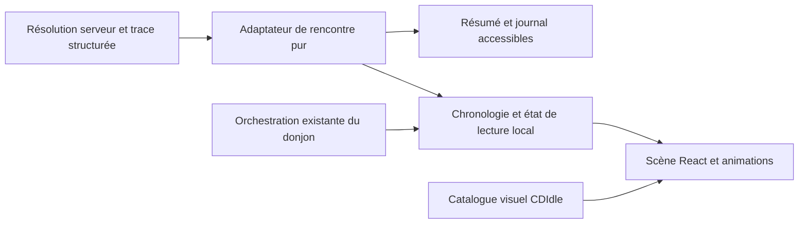

# Donjon — scène 2D des combats et rencontres

Date de recherche : 10 septembre 2026.
Statut : recherche et plan préparés ; redécoupage approuvé, appliqué et vérifié en vingt tickets.
Périmètre de cette session : recherche, plan et préparation des tickets uniquement.

## 1. Résultat attendu

Remplacer le transcript principal de la page Donjon par une scène 2D idle où
l'on voit les héros rencontrer un groupe ennemi, attaquer, subir des coups,
soigner et terminer la rencontre. Les rencontres hors combat reçoivent elles
aussi une mise en scène propre. Le joueur comprend ce qui arrive sans suivre
une succession de lignes de texte.

Direction confirmée par l'utilisateur le 10 septembre : **conserver les héros
et l'identité graphique CDIdle**, en s'inspirant de la mise en scène de Slime
Team Manager. Le pixel art miniature, les personnages et les décors de la
référence ne sont pas la direction artistique à reproduire.

Le remplacement concerne le contenu principal de `CurrentEncounterPanel`.
La progression, les commandes d'exploration, la gestion du groupe et les
décisions de jalon restent présentes. L'historique textuel demeure une voie
de consultation détaillée et accessible.

## 2. Recherche et niveau de preuve

### Référence externe figée

Dépôt étudié : [Arias1101/Slime-Team-Manager](https://github.com/Arias1101/Slime-Team-Manager),
commit `e6a37d95b870e643d0aee33f4162e60b551a6f07`, lu via l'API GitHub.
Le README, les scripts de rendu, les styles, la boucle de jeu et les ressources
ci-dessous ont été examinés. Deux images sources ont été inspectées directement.
Le jeu de référence n'a pas été exécuté : les mécanismes sont vérifiés dans
le code ; la qualité du mouvement en situation reste à comparer lors du prototype.

| Élément vérifié dans la référence | Adaptation proposée pour CDIdle | Source |
| --- | --- | --- |
| Une scène HTML positionnée, un fond fixe et des couches d'unités ; base de coordonnées 500 × 212 | Un espace de scène indépendant du viewport, avec composition adaptée aux quatre héros et aux groupes ennemis | [styles, ligne 574](https://github.com/Arias1101/Slime-Team-Manager/blob/e6a37d95b870e643d0aee33f4162e60b551a6f07/css/styles.css#L574) |
| Formation alliée stable, décalage avant/arrière et profondeur par position verticale | Emplacements stables et identification de chaque héros ; disposition purement visuelle, sans nouvelle règle de placement | [ui.js, ligne 582](https://github.com/Arias1101/Slime-Team-Manager/blob/e6a37d95b870e643d0aee33f4162e60b551a6f07/js/ui.js#L582) |
| Mouvement de repos, ombres, déplacement d'attaque, impact et retour | Respiration discrète, avancée ou bond court, attaque identifiable et retour à l'emplacement | [styles, ligne 720](https://github.com/Arias1101/Slime-Team-Manager/blob/e6a37d95b870e643d0aee33f4162e60b551a6f07/css/styles.css#L720), [slimes.js, ligne 597](https://github.com/Arias1101/Slime-Team-Manager/blob/e6a37d95b870e643d0aee33f4162e60b551a6f07/js/slimes.js#L597) |
| Projectiles décrits par sprite, durée, arc et rotation | Profils visuels de mêlée, tir, magie et soutien, choisis à partir des actions réellement reçues | [enemies.js, ligne 753](https://github.com/Arias1101/Slime-Team-Manager/blob/e6a37d95b870e643d0aee33f4162e60b551a6f07/js/enemies.js#L753) |
| Nombres flottants distincts pour dégâts, critiques et soins | Nombres attachés à la cible, synchronisés avec l'impact et les jauges | [slimes.js, ligne 75](https://github.com/Arias1101/Slime-Team-Manager/blob/e6a37d95b870e643d0aee33f4162e60b551a6f07/js/slimes.js#L75) |
| La boucle à 30 Hz et certaines animations exécutent aussi les dégâts et tirages côté client | Réutiliser les principes visuels ; toute résolution CDIdle continue de venir du serveur | [engine.js](https://github.com/Arias1101/Slime-Team-Manager/blob/e6a37d95b870e643d0aee33f4162e60b551a6f07/js/engine.js), [slimes.js, ligne 678](https://github.com/Arias1101/Slime-Team-Manager/blob/e6a37d95b870e643d0aee33f4162e60b551a6f07/js/slimes.js#L678) |

Les images [plain.jpg](https://github.com/Arias1101/Slime-Team-Manager/blob/e6a37d95b870e643d0aee33f4162e60b551a6f07/images/backgrounds/plain.jpg)
et [archer.png](https://github.com/Arias1101/Slime-Team-Manager/blob/e6a37d95b870e643d0aee33f4162e60b551a6f07/images/ennemies/archer.png)
confirment un fond panoramique pixelisé et de petites silhouettes détourées.
CDIdle conserve ses silhouettes plus détaillées et son univers souterrain.

L'API ne déclare pas de licence de dépôt et l'arborescence ne contient pas de
licence générale identifiée. Un document de licence spécifique existe dans
un pack temporaire d'effets ; son périmètre n'a pas été examiné. Ce constat
ne vaut pas analyse juridique. Le plan prévoit des créations CDIdle et aucune
copie du code ou des assets SLT ; toute réutilisation ultérieure devra faire
l'objet d'une vérification de provenance et des droits concernés.

### État CDIdle vérifié

Base de travail : `24be0dbc20d1615348b667a7cadff1edd40b361c` sur `main`.
L'arbre était propre avant cette recherche. Le Workboard comptait alors 96 tickets,
dont aucun en `Doing` ; son validateur avait réussi. Les créations et le
redécoupage ultérieurs sont documentés en sections 7 et 10.

| Source actuelle | Conséquence pour le plan |
| --- | --- |
| `src/components/dungeon/CurrentEncounterPanel.tsx` | Panneau fixe de 675 px, cartes ennemies et transcript défilant ; emplacement du remplacement |
| `src/domain/dungeonPresentation.ts` | Projection des PV ennemis à partir du transcript ; pas encore de projection complète des acteurs alliés |
| `src/domain/encounterPlayback.ts` | Un pas de 400 ms par événement affiché, `enemy.intent` exclu, puis un dernier pas de 400 ms |
| `src/hooks/useAuthoritativeCommandDispatch.ts` | L'état final est appliqué avant la lecture ; la promesse de dispatch attend ensuite la lecture |
| `src/hooks/useDungeonAutomation.ts` | L'automatisation attend ce dispatch puis 4 750 ms ; un seul `dungeon.auto_advance` par rencontre nominale ; arrêt des nouveaux départs quand le document est masqué |
| `src/hooks/useCrossTabGameSynchronization.ts` | Un autre onglet peut recevoir une rencontre terminée et démarrer sa lecture |
| `shared/contracts/authoritative.ts` | Trace structurée mais ouverte (`type: string` et champs supplémentaires), absence de capture complète des acteurs au départ dans le record |
| `shared/domain/hero.ts` | `ACTIVE_HERO_LIMIT = 4` |
| `shared/domain/undercity.ts` | Cinq zones, chacune avec quatre rencontres régulières, une élite et un boss ; groupes actuels de un à trois ennemis |
| `src/assets/heroSpriteSheets.ts`, `src/domain/heroPortrait.ts` | Novice + neuf classes T1, deux sexes, vingt variantes ; identité stable par héros |
| `src/components/HeroPortrait.tsx` | Découpage et détourage du fond vert au chargement ; les vingt cases sont des individus, pas des frames d'animation |
| `tests/browser/dungeonPage.responsive.browser.spec.ts` | Des assertions exigent actuellement la hauteur 675 px et le transcript défilant ; elles devront évoluer avec le périmètre accepté |

La planche Guerrier homme a été inspectée : une pose par personnage, orientée
en trois-quarts. La qualité de toutes les découpes, transparences et échelles
sur un décor sombre n'a pas encore été validée. L'inventaire d'assets examiné
ne fournit pas de collection dédiée aux ennemis et aux cinq décors de combat.

### Écarts à traiter avant le rendu fidèle

Ce sont des constats de recherche, pas des corrections réalisées.

| Priorité | Constat et preuve | Traitement prévu / rentabilité |
| --- | --- | --- |
| P1 | Dans la branche de compétence offensive monocible, `damageUndercityEnemy` peut tuer la cible ; `primaryUndercityEnemy` est ensuite réaffecté avant de remplir `monsterId` et `enemyHp` du log (`authoritative-dungeon.ts`, autour des lignes 663–680) | CDI-105 : reproduire le cas puis conserver la cible de l'impact dans la trace. Très rentable : évite d'animer le coup sur le survivant suivant. Le constat est statique, pas encore reproduit par un test dédié |
| P1 | Le record terminé ne capture pas tous les héros et leurs PV/PM initiaux ; le snapshot vivant contient déjà les valeurs finales et peut ensuite changer | CDI-098 : capture compacte des acteurs au début ; ne pas reconstruire les PV antérieurs depuis les héros actuels |
| P1 | Mana consommé non systématiquement tracé, cibles de debuffs collectifs incomplètes, `effects` finaux vides ; intentions actuellement filtrées | CDI-098 définit la matrice ; CDI-106 complète ressources/cibles ; CDI-114 trace et représente statuts/intentions. Afficher seulement les effets réellement prouvés |
| P1 | La cadence des futures commandes dépend de la durée de lecture | CDI-107/CDI-103 : animation et calendrier de jeu séparés explicitement ; aucune accélération involontaire de progression ou d'egress |
| P1 | Les nouveaux détails seront conservés dans jusqu'à quinze rencontres et renvoyés dans les snapshots | CDI-098/CDI-106/CDI-114 puis CDI-116/CDI-104 : données bornées, mesure des octets et budget CDI-095 ; pas de snapshot complet du héros à chaque événement |
| P2 | Portraits non animés et ressources ennemies/décors à produire | CDI-099 : catalogue/héros/kit pilote ; CDI-108 à CDI-112 : packs de zone ; CDI-102/CDI-115 : accessoires hors combat. Travail artistique nécessaire, pas un simple branchement CSS |

## 3. Expérience et périmètre visuel

### Composition proposée

Une scène latérale en légère profondeur occupe l'ancien espace de transcript.
Les héros se trouvent à gauche, les ennemis ou l'objet de rencontre à droite
ou au centre. Les ombres fixent les personnages au sol. Les noms, PV/PM utiles
et statuts restent lisibles dans des éléments HTML. La profondeur et la
formation sont décoratives ; elles ne changent ni les cibles ni les règles.

Le titre, l'étage, la salle et les commandes restent hors de la zone d'effets.
Le tableau de cartes ennemies peut être remplacé par des informations associées
aux silhouettes pour éviter une double présentation, après validation structurelle.
Le panneau de gestion du groupe et l'historique restent à leur place actuelle.

La phase actuelle cible uniquement le mode PC. Tester 1024, 1280 et 1440 px,
ainsi que le zoom 200 %. Les actions restent accessibles au clavier, avec les
cibles de 44 px du design system. Les viewports inférieurs à 1024 px et une
composition mobile/tablette sont différés : aucun comportement adapté ne doit
être revendiqué pendant cette phase.

### Parcours d'une rencontre

1. Attente ou préparation : équipe présente, animation de repos discrète.
2. Réponse en cours : déplacement d'ambiance sans ennemi ni résultat inventé.
3. Entrée : décor et protagonistes identifiés depuis la rencontre reçue.
4. Lecture : anticipation, attaque ou interaction, impact, évolution de jauge,
   retour ; des mouvements de repos peuvent se superposer sans créer d'actions.
5. Résultat : issue, pertes et récompenses exactes, puis prochaine rencontre
   ou décision de jalon selon l'état autoritaire.

Une équipe engagée conserve ses places et son identité. Un héros KO reste
représenté comme KO dans le segment, n'attaque plus et peut se relever pendant
une salle de repos si la trace l'indique. L'échec d'une épreuve ne doit pas
être mis en scène comme un wipe de combat.

### Vocabulaire d'animation

| Action | Lecture visuelle attendue |
| --- | --- |
| Attaque physique | Avancée courte, frappe ou slash, impact, retour |
| Tir | Anticipation, projectile vers la cible identifiée, impact |
| Sort offensif | Geste de lancement, effet associé à la compétence ou au type de dégâts |
| Soin allié / soutien ennemi | Effet positif sur la bonne cible, nombre positif, PV au bon instant |
| Critique / multi-frappe | Accent bref / impacts ordonnés ; aucun dégât supplémentaire inventé |
| Esquive | Mouvement d'évitement et libellé, sans diminution de PV |
| Buff, debuff, protection et phase du Roi | Marqueurs issus des événements structurés, avec fin d'effet explicite |
| KO / réanimation | Affaissement et immobilité / retour progressif ; statut issu de la rencontre |
| Victoire, défaite et butin | Transition lisible et résultat récapitulatif ; collecte visuelle sans interaction obligatoire |

V1 proposée : animer les silhouettes détourées par translation, inclinaison,
petite déformation et effets 2D. Aucun cycle complet de marche par variante
n'est nécessaire à ce modèle, mais le prototype doit démontrer un combat vivant.
Une pose statique qui glisse sans anticipation ni impact ne suffit pas.
Si ce rendu est jugé insuffisant, réviser le lot artistique avant sa généralisation.

### Prototype PC CDI-097 implémenté — validation visuelle obtenue

Le prototype isolé est disponible uniquement dans le catalogue privé de
développement, section « Donjon 2D — prototype PC ». Il utilise des fixtures
locales : aucune sauvegarde, résolution, commande réseau ou progression du jeu
n'est branchée. La mention « présentation uniquement » distingue explicitement
ses boutons des commandes d'exploration.

Contrat structurel implémenté :

- scène normalisée avec emplacements stables calculés dans
  `src/domain/dungeonScenePrototype.ts`, hors des composants React ;
- formation latérale standard à 1024/1280/1440 px et recomposition verticale
  spécifique au PC à zoom 200 % ; ce second plan ne promet aucun support mobile ;
- quatre emplacements de héros et trois d'ennemis, couches de profondeur,
  ombres, noms, rôles, PV/PM, résumé et journal HTML repliable ;
- cinq fixtures : attente, combat 4 contre 3, Roi avec deux gardes, repos avec
  héros KO, et épreuve avec héros sélectionné ;
- silhouettes héros CDIdle existantes via `HeroPortrait`. Les ennemis utilisent
  volontairement des silhouettes de remplacement différenciées : rat, garde,
  Roi. Leur production finale reste dans CDI-099/CDI-108–112 ;
- état à un instant déterminé par une fonction pure et un curseur : position
  0–300 ms, anticipation 300–550, déplacement 550–950, impact 950–1 150,
  retour 1 150–1 750, résultat 1 750–2 300 ;
- la lecture en boucle ne fait que déplacer le curseur local. Reduced-motion
  supprime transitions et animation d'impact sans modifier l'état projeté ;
- bornes de scène : 31 rem en composition standard, 34 rem au zoom ; largeur
  d'acteur bornée, maximum quatre héros/trois ennemis et un impact temporaire
  dans ce prototype.

Les tests déterministes couvrent les cinq fixtures, les deux plans de placement
PC, les phases exactes, le retour à l'emplacement et l'absence d'action pendant
l'attente. La suite navigateur dédiée à 1024/1280/1440 px et à l'équivalent
CSS de 1024 px à zoom 200 % a été exécutée par l'utilisateur : quatre tests
réussis en 5,8 s.

Le 10 septembre 2026, l'utilisateur a validé la composition, les silhouettes
transformées et la cadence après un ajustement du cycle de 2 800 à 2 300 ms.
Cette validation permet de poursuivre CDI-099 sans imposer de poses dédiées.
Le prototype reste une scène de présentation et ne prouve ni les futurs assets
ni la fluidité finale en production.

### Toutes les rencontres hors combat

| Type canonique | Mise en scène | Informations conservées |
| --- | --- | --- |
| `treasure` | Approche, inspection et ouverture du coffre | Contenu exact ou absence de contenu, or, matériau, plan |
| `rest` | Halte, récupération et éventuelle réanimation | PV/PM avant et après de chaque membre concerné |
| `trap` | Héros qualifié au premier plan, désamorçage ou déclenchement | Héros choisi, résultat, pertes réelles |
| `enigma` | Interaction avec un dispositif, activation ou contrecoup | Jet reçu, difficulté, restauration ou perte de mana |
| `ambush` | Menace révélée, évitement ou choc bref | Épreuve actuelle, pas de combat supplémentaire fabriqué |
| `ritual` | Cercle ou foyer runique, stabilisation ou échec | Héros, mana et conséquences exactes |
| `obstacle` | Dégagement ou passage forcé | Héros choisi, réussite/échec, pertes |
| `negotiation` | Interlocuteur, échange et accord ou refus | Or gagné/perdu et issue, sans choix interactif nouveau |

## 4. Architecture proposée

Choix recommandé pour cette taille de scène : DOM/React + CSS et Motion déjà
installé. React compose les acteurs et l'interface ; les propriétés animées
n'entraînent pas une mise à jour de toute l'application à chaque frame.
Les transitions et keyframes sont prises en charge par
[Motion pour React](https://motion.dev/docs/react-animation).

Canvas, Pixi ou Phaser ne sont pas nécessaires au plan initial. Un changement
de moteur demanderait une mesure démontrant une limite réelle du prototype,
ainsi qu'un bilan de bundle, accessibilité et maintenance.



La scène ne renvoie aucune mutation au domaine. Les commandes existantes
restent portées par les contrôles et l'orchestration applicative.

### Contrat de données : CDI-098, CDI-106 et CDI-114

CDI-098 livre les acteurs initiaux et la compatibilité du record ; CDI-105
corrige la cible létale ; CDI-106 complète ressources, cibles et conséquences ;
CDI-114 couvre les statuts/intentions de la trace jusqu'au rendu. La projection
pure de base est portée par CDI-100 et le lecteur temporel par CDI-107.

CDI-100 livre `encounterSceneProjection.ts` comme adaptateur pur unique : il
conserve les acteurs historiques, ordonne et regroupe les événements, produit
des impacts identifiés de manière stable et calcule l'état directement ou pas
à pas avec le même résultat. Une valeur absente reste `null` et le panneau
historique l'annonce au lieu de la reconstruire depuis l'état final. Le filtre
`enemy.intent` reste partagé avec le lecteur existant et n'ajoute aucun pas au
calendrier. CDI-106, CDI-107 et CDI-114 conservent respectivement les
enrichissements de trace, l'horloge annulable et les statuts/intentions.

- Conserver un unique transcript autoritaire ; ne pas créer un second moteur
  ni un deuxième journal persistant concurrent.
- Ajouter une extension versionnée et facultative au record pour les nouvelles
  rencontres : identités visuelles stables, positions d'équipe et PV/PM initiaux
  nécessaires. Capturer au départ, avant toute modification de combat ou d'XP.
- Identifier les ennemis par une clé de contenu stable (blueprint et membre),
  distincte de leur nom traduit et de l'identifiant d'instance de la rencontre.
- Compléter les événements existants avec auteur, cibles, valeurs après effet,
  coût de mana et références de compétence lorsque nécessaire. Distinguer
  dégâts annoncés et PV effectivement retirés, notamment au coup létal.
- Fixer les changements de tour, les cibles multiples et les durées d'effets
  pour éviter toute déduction à partir du texte français. Les données visuelles
  n'influencent aucun tirage RNG, aucune cible, aucun résultat ni récompense.
- Garder le support des records historiques et événements inconnus. Si les
  données sont insuffisantes, fournir un résumé/journal fidèle et une scène
  neutre, sans PV ou identité historiques inventés.
- Valider l'extension aux frontières existantes : API, cache, bootstrap,
  cross-tab, replay et état persistant. Justifier une migration seulement si
  elle devient nécessaire ; ne pas reconstruire des événements anciens perdus.

#### Extension initiale livrée par CDI-098

`CanonicalDungeonEncounterRecord.initialActors` est facultatif afin que les
records historiques restent valides. Pour une nouvelle rencontre, sa forme
compacte et versionnée est :

```ts
{
  v: 1;
  h: Array<[
    id: string,
    visual: string,
    currentHp: number,
    maximumHp: number,
    currentMana: number,
    maximumMana: number,
    knockedOut: 0 | 1,
  ]>;
  b?: string;
  e: Array<[memberKey: string, currentHp: number, maximumHp: number]>;
}
```

Les clés filaires courtes et les tuples évitent de répéter les noms de champs
dans quinze rencontres ; les types nommés documentent chaque position.
L'index dans `h` ou `e` est la place stable, de gauche à droite, dans son
équipe. `visual` fige la clé de portrait CDIdle déjà résolue
`<classe>_<genre>_<variante>` ; elle ne dépend donc ni du héros vivant après
la rencontre ni d'une vocation ultérieure. Le nom n'est pas dupliqué : si le
héros n'existe plus dans le roster, CDI-100 emploie le libellé neutre prévu au
lieu d'inventer une identité historique.

En combat, l'identité de contenu ennemie est le couple `b` + `memberKey`.
Chaque membre du blueprint possède une clé courte explicite et immuable,
indépendante de sa position ; un réordonnancement déplace la clé avec son
membre. Nom, rôle, boss et identifiant d'instance restent dans `enemies` sur le
même index et ne sont pas dupliqués. Le validateur impose le même nombre
d'ennemis initiaux et finaux. Il ne rejette pas un blueprint retiré du
catalogue courant : une trace historique inconnue reste consultable avec le
fallback neutre. Hors combat, `b` est absent et `e` est vide. L'extension est
capturée avant
toute résolution, consommation de PM, perte de PV, réanimation ou attribution
d'XP. Un record sans extension n'est jamais complété avec des valeurs déduites.

L'événement `dungeon.encounter_resolved` ne duplique plus le record complet :
il transporte son `encounterId`, et le client lit le record déjà présent dans
`state.encounterHistory`. Le client accepte encore l'ancien événement enrichi.

#### Matrice des neuf types et propriétaires restants

| Type | Acteurs initiaux disponibles après CDI-098 | Données d'action encore incomplètes | Propriétaire |
|---|---|---|---|
| `fight` | Héros du segment, KO inclus ; groupe ennemi, clés de contenu et PV initiaux | Cible létale correcte livrée ; coûts de PM, cibles multiples et valeurs effectivement appliquées à uniformiser ; statuts et intentions à compléter | CDI-105 livré ; CDI-106 ; CDI-114 |
| `trap` | Héros du segment, PV/PM/KO initiaux ; aucun ennemi inventé | Cibles et pertes appliquées à normaliser depuis `heroChanges` | CDI-106 |
| `enigma` | Même capture, avant sélection et restauration/consommation | Coût ou gain de PM et cible sélectionnée à projeter uniformément | CDI-106 |
| `ambush` | Même capture, avant la conséquence collective | Cibles multiples et PV effectivement retirés à expliciter | CDI-106 |
| `ritual` | Même capture, avant restauration ou contrecoup | Coût ou gain de PM et cible sélectionnée à expliciter | CDI-106 |
| `obstacle` | Même capture, avant la perte collective | Cibles multiples et PV effectivement retirés à expliciter | CDI-106 |
| `negotiation` | Même capture ; aucun ennemi inventé | Variation d'or déjà tracée, projection ressource à uniformiser | CDI-106 |
| `treasure` | Même capture ; aucun ennemi inventé | Récompenses exactes déjà dans `rewards`, pas de complément acteur requis | Aucun pour le contrat initial |
| `rest` | Héros du segment et KO capturés avant réanimation | Cibles et valeurs de récupération déjà présentes, projection uniforme à finaliser | CDI-106 |

Pour tous les types, la durée et l'expiration des effets ainsi que la
représentation fiable des intentions restent la responsabilité de CDI-114.
La matrice ne déclare donc pas ces champs livrés par CDI-098.

Fichiers pressentis : contrats et producteur partagé existants ; modules de
présentation `src/domain/encounterScene.ts`, `encounterTimeline.ts` et catalogue
`src/assets/encounterVisuals.ts` ; composants sous
`src/components/dungeon/encounter/`. Ces nouveaux noms sont des propositions,
pas des fichiers déjà implémentés.

### Horloge, annulation et cadence idle

Conserver en V1 la cadence de référence : `(N + 1) × 400 ms` de lecture, où
`N` est le nombre d'événements qui participent aujourd'hui au calendrier,
puis le délai existant de 4 750 ms avant le prochain départ automatique.
Les nouvelles informations purement visuelles ne doivent pas ajouter de tours
d'attente. Les animations se logent dans ce calendrier ; leurs callbacks de fin
ne commandent ni le prochain combat ni l'attribution des récompenses.

La chronologie de présentation doit pouvoir calculer directement l'état à un
instant donné. Une fréquence d'écran différente, une animation désactivée ou
un asset lent ne change donc pas le calendrier de jeu. Pour une interpolation
manuelle, utiliser le timestamp d'animation : `requestAnimationFrame` peut être
suspendu en arrière-plan et sa fréquence suit l'écran.
[Documentation navigateur](https://developer.mozilla.org/en-US/docs/Web/API/Window/requestAnimationFrame).

- Page CDIdle autre que Donjon : pas de travail d'animation de scène ; préserver
  le comportement de progression existant de l'application visible.
- Document masqué : suspendre les animations et les nouveaux départs ; au retour,
  se recaler sur la dernière rencontre, sans rafale de commandes ni file de films.
- Révision plus récente, reset, déconnexion, changement de compte ou nouvelle
  rencontre : invalider la lecture obsolète et libérer ses ressources.
- Doublon/replay du même `encounterId` : pas de nouvelle attribution et pas de
  redémarrage visuel automatique en boucle.
- Mauvaise réponse ou conflit : état d'attente/erreur cohérent, jamais une
  victoire avant réception d'une preuve serveur.
- Mode observateur : lecture possible, mutation interdite ; changement de leader
  sans double automate.

Les panneaux extérieurs à la scène continuent de refléter l'état reçu. Les PV
intermédiaires de la scène sont des valeurs de lecture, jamais réinjectées dans
le snapshot. Résultat, rencontre suivante et décision de jalon doivent avoir
une priorité explicite ; une animation périmée ne masque pas une décision actuelle.

## 5. Production artistique et budgets

CDI-099 livre le catalogue, la préparation réutilisable des 400 identités
humaines actuelles (10 classes × 2 sexes × 20 variantes) et le kit pilote :
décor des Égouts et trois membres de `rat-pack`. CDI-108 à CDI-112 couvrent
chacun une zone, soit les trente blueprints UnderCity et cinq ambiances au
total ; CDI-108 réutilise les ressources du pilote. Les accessoires trésor/repos
appartiennent à CDI-102 et ceux des six épreuves à CDI-115. Les effets visuels
sont livrés avec les actions correspondantes dans CDI-101/CDI-113/CDI-114.

Le catalogue actuel contient 63 emplacements de membres dans trente
blueprints ; ce n'est pas une exigence de 63 illustrations originales.
Cela n'exige pas non plus 400 animations dessinées : les transformations
peuvent partager des profils. Les ennemis peuvent partager une famille visuelle
avec des variantes lisibles ; les élites et boss restent identifiables.

Chaque ressource possède une origine, une clé stable, un cadrage, un ancrage
au sol, une échelle et un fallback documentés. Optimiser les extraits et
préparer la transparence hors de la boucle d'animation ; ne pas détourer à
nouveau une grande planche à chaque action. Le chargement suit la zone et les
acteurs visibles, avec cache borné et nettoyage en sortie de session.

Garde-fous proposés à contrôler dans les tickets, à mesurer sur le produit
complet dans CDI-116 puis à consolider lors de CDI-104 :

- Budget JS existant inchangé : somme gzip des fichiers JS ≤ 250 KiB et plus
  gros fichier ≤ 300 KiB (`check:bundle` contrôle la somme, pas uniquement l'entrée).
- Budget artistique initial proposé : ≤ 2 MiB de téléchargements supplémentaires
  à froid pour une scène de zone et son groupe affiché ; mesurer séparément le
  trafic déjà nécessaire aux portraits. À confirmer avec les assets réels.
- Maximum initial de travail visuel : 4 héros, 3 ennemis, 16 effets temporaires
  simultanés. Les nombres peuvent être regroupés si leur total reste exact ;
  aucun événement métier ne disparaît du journal.
- Cible de fluidité à mesurer : 60 images/s sur le poste PC de référence aux
  trois largeurs retenues. Consigner appareil, viewport, navigateur, charge et
  durée ; cette valeur n'est pas un résultat acquis.
- Zéro boucle d'animation de scène hors vue ; pas de croissance du nombre de
  nœuds, écouteurs et timers après une campagne déterministe de 100 rencontres.
- Historique canonique toujours borné à quinze entrées ; mesurer les octets
  ajoutés sur petits, moyens et grands profils et sur des traces réelles longues.
- Préserver la projection et les seuils du [budget egress](supabase-egress-budget.md).
  Le problème d'inventaire suivi par CDI-096 reste distinct de ce chantier.

## 6. Accessibilité et comportement dégradé

Le journal et le résumé portent toute information nécessaire. Les effets
décoratifs sont masqués aux lecteurs d'écran ; une seule annonce synthétique
signale les changements importants, sans lecture de chaque particule ou dégât.
Les intentions, critiques et KO ne reposent pas sur la couleur seule.

Respecter le réglage de réduction des mouvements et prévoir une préférence
locale pour désactiver les animations. Ce mode garde les résultats et le
calendrier de jeu identiques, avec transitions simples et sans secousses.
[Référence navigateur](https://developer.mozilla.org/en-US/docs/Web/CSS/Reference/At-rules/@media/prefers-reduced-motion).

Asset manquant, événement inconnu ou ancien record : conserver un acteur neutre
ou le résumé fidèle, sans page vide ni blocage de l'exploration. Un historique
déjà terminé se présente comme terminé après rechargement ; pas de replay
automatique des quinze dernières rencontres.

## 7. Découpage Workboard approuvé

Le redécoupage en **vingt tickets — 1 S, 14 M et 5 L** a été confirmé par
l'utilisateur le 10 septembre 2026 : « Oui, applique ce découpage ».
Les huit axes du plan initial restent couverts, sans créer de tickets parents
redondants. Les tickets Markdown liés ci-dessous sont la source de vérité de
leur contenu et de leur statut.

L'[aperçu approuvé et sa justification des tailles](dungeon-2d-resizing-proposal.md)
conservent les périmètres, limites et la correspondance des huit anciens lots
avec les vingt tickets. L'[archive de création initiale](dungeon-2d-workboard-proposal.json)
reste inchangée : elle décrit historiquement les huit tickets avant redécoupage,
pas leur contenu actuel.

| Ticket | Livrable | Statut au redécoupage | Taille / risque | Dépendances |
| --- | --- | --- | --- | --- |
| [CDI-097](../../workboard/data/Done/CDI-097/ticket.md) | Valider la composition PC de la scène Donjon 2D | Done | M / medium | Aucune |
| [CDI-098](../../workboard/data/Done/CDI-098/ticket.md) | Capturer les acteurs initiaux dans un contrat de rencontre compatible | Done | L / high | CDI-097 |
| [CDI-099](../../workboard/data/Done/CDI-099/ticket.md) | Préparer le catalogue visuel et le kit pilote CDIdle | Done | L / medium | CDI-097 |
| [CDI-100](../../workboard/data/Done/CDI-100/ticket.md) | Projeter les rencontres en états de scène déterministes | Done | M / high | CDI-098, CDI-105 |
| [CDI-101](../../workboard/data/Done/CDI-101/ticket.md) | Construire la scène de combat simple CDIdle | Done | M / medium | CDI-099, CDI-107 |
| [CDI-102](../../workboard/data/Later/CDI-102/ticket.md) | Mettre en scène trésors, repos et réanimations | Later | M / medium | CDI-103, CDI-106 |
| [CDI-103](../../workboard/data/Later/CDI-103/ticket.md) | Intégrer le premier combat et sécuriser son cycle de lecture | Later | L / high | CDI-101 |
| [CDI-104](../../workboard/data/Later/CDI-104/ticket.md) | Consolider la recette et préparer la livraison des rencontres 2D | Later | M / high | CDI-116 |
| [CDI-105](../../workboard/data/Done/CDI-105/ticket.md) | Corriger la cible journalisée par une compétence létale | Done | S / high | Aucune |
| [CDI-106](../../workboard/data/Later/CDI-106/ticket.md) | Compléter les traces et projections de ressources et de cibles | Later | M / high | CDI-098, CDI-100 |
| [CDI-107](../../workboard/data/Done/CDI-107/ticket.md) | Construire le lecteur temporel annulable à cadence constante | Done | M / high | CDI-100 |
| [CDI-108](../../workboard/data/Later/CDI-108/ticket.md) | Compléter les assets des Égouts infestés | Later | M / medium | CDI-099 |
| [CDI-109](../../workboard/data/Later/CDI-109/ticket.md) | Produire les assets des Galeries des contrebandiers | Later | M / medium | CDI-099 |
| [CDI-110](../../workboard/data/Later/CDI-110/ticket.md) | Produire les assets des Citernes oubliées | Later | M / medium | CDI-099 |
| [CDI-111](../../workboard/data/Later/CDI-111/ticket.md) | Produire les assets du Bastion des Exclus | Later | M / medium | CDI-099 |
| [CDI-112](../../workboard/data/Later/CDI-112/ticket.md) | Produire les assets de la Cour du Roi des Rats | Later | M / medium | CDI-099 |
| [CDI-113](../../workboard/data/Later/CDI-113/ticket.md) | Animer les compétences, projectiles et soins du combat | Later | M / medium | CDI-103, CDI-106 |
| [CDI-114](../../workboard/data/Later/CDI-114/ticket.md) | Tracer et représenter les statuts, intentions et protections | Later | L / high | CDI-113 |
| [CDI-115](../../workboard/data/Later/CDI-115/ticket.md) | Mettre en scène les six épreuves du Donjon | Later | L / medium | CDI-102 |
| [CDI-116](../../workboard/data/Later/CDI-116/ticket.md) | Mesurer et stabiliser les performances des scènes complètes | Later | M / high | CDI-108, CDI-109, CDI-110, CDI-111, CDI-112, CDI-114, CDI-115 |

Les tailles sont relatives et incluent tests, documentation et revue, hors
attente utilisateur. Les L sont justifiés : contrat persistant traversant ses
frontières (098), catalogue et kit pilote réutilisables (099), dispatch/automate/
annulation à valider ensemble (103), statuts du producteur au rendu (114), et
six variantes du même contrat de défi après extraction de trésor/repos (115).
Des poses dédiées décidées dans CDI-097 nécessiteraient de réestimer l'art.

Priorité : P1 pour les vingt tickets du chantier ; ce rang ne signifie pas
incident de production généralisé. CDI-097, CDI-098, CDI-099, CDI-100, CDI-105
et CDI-107 sont Done ; les autres restent Later jusqu'à leurs prérequis Done.
Les acquis CDI-076, CDI-078, CDI-080, CDI-083, CDI-094 et CDI-095 restent des
références livrées sans modification de leurs tickets. L'ancien modèle de
bestiaire CDI-086 ne gouverne pas le contenu UnderCity actuel.

Ordre : prototype 097 et correction indépendante 105 ; contrat 098 et kit 099 ;
projection 100, lecteur 107, combat simple 101 puis **première intégration 103**.
Ressources/cibles 106 peut avancer dès ses prérequis. Les packs 108–112 et les
extensions intégrées 102/113/114/115 complètent ensuite le produit ; mesures
116 puis recette 104. Chaque ticket produit ses propres tests et preuves.

Le pilote peut utiliser des fallbacks neutres honnêtes pour l'art ou les actions
non encore finalisés, et garder temporairement le rendu non-combat existant.
Ces états transitoires sont fermés par les packs et extensions identifiés ; ils
ne satisfont pas le résultat final. CDI-116 dépend de toutes les branches
terminales et CDI-104 de 116, ce qui impose les vingt tickets avant clôture.
Aucun déploiement partiel n'est autorisé par ce seul plan.

## 8. Matrice de validation à réaliser

| ID | Scénario / preuve requise | Tickets responsables |
| --- | --- | --- |
| V01 | 1 à 4 héros, 1 à 3 ennemis, mêmes variantes et places après rechargement | 097, 098, 099, 100, 108–112 |
| V02 | Coup normal, critique, esquive, multi-frappe et coup létal sur le bon acteur | 105, 100, 101, 106, 113 |
| V03 | Compétence qui tue une cible avec un survivant suivant : id et PV exacts | 105, 100, 101, 113 |
| V04 | Soin allié, soutien ennemi, buff/debuff multicible, mana et expiration | 106, 113, 114 |
| V05 | Gardes/protection du Roi puis changement d'intention ; aucun faux effet inventé | 114, 112 |
| V06 | Héros déjà KO, nouveau KO, wipe et repos avec réanimation du segment | 098, 100, 101, 102, 103 |
| V07 | Huit types hors combat, branches succès/échec applicables, butin exact | 106, 102, 115 |
| V08 | Jalons 5/10/50, continuer/retour, vocation, progression puis sélection de farm | 103 |
| V09 | Lecture activée/désactivée, autre page CDIdle et écran rapide : mêmes départs et résultats | 107, 103 |
| V10 | Onglet masqué, retour visible, navigation et démontage sans rattrapage animé en rafale | 107, 103 |
| V11 | Replay, doublon, conflit, snapshot plus récent, autre onglet et changement de leader | 098, 107, 103, 104 |
| V12 | Reset, déconnexion/changement de compte, erreur réseau et lecture seule | 107, 103, 104 |
| V13 | Ancien record, héros absent du roster actuel, événement inconnu, asset lent/manquant | 098, 099, 100, 103, 108–112 |
| V14 | Clavier, libellés, résumé, historique et mouvements réduits | 097, 101, 102, 103, 113, 114, 115, 104 |
| V15 | 1024/1280/1440 px et zoom 200 %, quatre héros et boss avec gardes | 097, 101, 108–112, 104 |
| V16 | Campagne longue, cadence identique, ressources libérées, fluidité et octets mesurés | 107, 116 |
| V17 | Trace nouvelle et ancienne sur pipeline Supabase local, persistance, replay et concurrence | 098, 106, 114, 104 |
| V18 | Avis visuel utilisateur sur le prototype puis sur combat, boss, repos et épreuve intégrés | 097, 099, 101, 102, 108–115, 104 |

CDI-104 consolide les dix-huit preuves ; chaque propriétaire les produit dès
son ticket. CDI-116 porte les mesures et l'endurance sur le produit complet.

Réutiliser les fixtures et harnesses existants. Étendre les suites
`encounterPlayback`, `dungeonPresentation`, `DungeonPanel`,
`useDungeonAutomation`, `useCrossTabGameSynchronization`,
`authoritativeContracts`, `authoritativeDungeonGolden`, `dungeonSegmentHarness`
et `egressBudget` selon les changements. Ajouter des tests de projection et
chronologie à horloge injectée, ainsi que la couverture réelle des types d'actions.

Les simulations prouvent l'ordre, les valeurs et les annulations, pas la
qualité artistique ou le coût réel du rendu. Les contrôles visuels reviennent
à l'utilisateur selon AGENTS.md. Les tests navigateur nécessitent le cadre
d'autorisation prévu par le projet. Une preuve locale Supabase reste requise
si le contrat persistant évolue. Aucune de ces validations futures n'est
déclarée passée par la présente recherche.

## 9. Sujets différés et critères de reprise

| Sujet différé | Implication / dépendance | Condition de reprise et de clôture |
| --- | --- | --- |
| Poses dessinées de marche/attaque par variante, animation squelettique | Charge artistique supérieure ; dépend du verdict CDI-097 et nécessite de réestimer CDI-099/CDI-108–112 et les scènes concernées | Réouvrir si les silhouettes transformées ne satisfont pas la validation ; terminer après couverture et validation des poses retenues |
| Boutons vitesse, pause de lecture et replay animé de tout l'historique | Risque de modifier la cadence économique ou de créer une file de scènes | Décision produit et contrat de cadence explicites, puis preuves sans commande ni gain supplémentaire |
| Son et musique | Ressources, provenance et préférences supplémentaires | Demande dédiée ; contrôle utilisateur et réglages persistants après ajout |
| Nouveau bestiaire, nouveaux combats, formations tactiques ou simulation physique | Changements de gameplay et d'équilibrage | Tickets produit dédiés et nouvelles preuves métier ; non requis pour représenter le contenu actuel |
| Adoption d'un moteur Canvas/WebGL | Bundle et maintenance supplémentaires | Limite mesurée du rendu initial et prototype comparatif concluants |
| Composition mobile/tablette sous 1024 px | Aucun support adapté n'est promis pendant la phase PC ; un simple rétrécissement rendrait noms et commandes illisibles | Demande produit dédiée après stabilisation PC ; définir breakpoints, recomposition, performances et matrice visuelle mobile avant implémentation, puis valider sur appareils identifiés |

## 10. Historique des créations, redécoupage et reprise

Le 10 septembre 2026, après l'aperçu, l'utilisateur a confirmé :
« Crée les huit tickets ». Les huit fichiers CDI-097 à CDI-104
avaient été créés avec les contenus exacts de la proposition initiale approuvée.
Leur contenu a ensuite été recadré par l'accord de redécoupage ; l'archive
initiale n'a pas été réécrite.

Preuves historiques obtenues par Codex après la création initiale :

- `npm.cmd run board:validate` : **104 tickets, 0 erreur** ; les dépendances,
  liens réciproques, statuts et limite WIP sont valides.
- Comparaison de chaque fichier avec la sérialisation Workboard de la
  proposition : correspondance exacte pour les huit tickets.
- Chaque identifiant apparaît une seule fois, dans la colonne prévue ;
  tous les documents référencés existent.
- Aucun des 96 tickets antérieurs, aucun paramètre Workboard et aucun fichier
  applicatif n'a été modifié pour cette création. Synchronisation GitHub inactive.

Le sandbox a refusé la création des dossiers. Une élévation ciblée a permis
de créer uniquement les huit dossiers vérifiés ; leur contenu a ensuite été
écrit avec `apply_patch`, conformément à la procédure du dépôt.

Le redécoupage ultérieur approuvé conserve CDI-097 à CDI-104, ajoute CDI-105
à CDI-116 et distribue tous les critères initiaux sans modifier les règles du
produit. Les vingt tickets sont écrits et vérifiés : **1 S, 14 M, 5 L**.
`npm.cmd run board:validate` confirme **116 tickets, zéro erreur** ; les contenus
préparés et la sérialisation officielle correspondent aux vingt fichiers.
Les 49 critères initiaux sont répartis et les propriétaires de V01–V18 sont
synchronisés. Tous les lots appartiennent au graphe de clôture de CDI-104.
Les 96 tickets antérieurs, l'archive initiale et la configuration sont inchangés.
Les preuves détaillées et la note sur le document de déploiement modifié
concurremment figurent dans la [section d'application du redécoupage](dungeon-2d-resizing-proposal.md).
Aucun code applicatif ni état Git n'a été modifié par cette application.

Au moment du redécoupage, les prochains tickets exécutables étaient CDI-097
(prototype) et CDI-105 (correction de trace indépendante) ; leur implémentation
n'avait alors pas commencé.
Le présent document ne déclare aucune animation livrée ni validation visuelle
future déjà obtenue. Commit, push et déploiement restent des étapes distinctes
avec les confirmations prévues dans AGENTS.md.

Limites documentaires conservées : le handoff sprites du 9 septembre est
antérieur à l'intégration des dix classes visuelles ; le plan segments/KO
indique encore une validation visuelle finale ouverte. Le chantier 2D reprend
les règles du code actuel et ne prétend pas clôturer ces validations anciennes.
